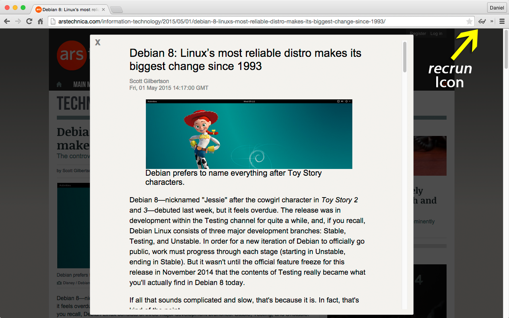

recrun
======

recrun is an acronym that stands for *retain essential content, remove unwanted noise*.

To use recrun, install the extension, navigate to an article web page,
and click the eyeglasses icon in the Chrome toolbar (there is an arrow pointing
to this icon in the recrun screenshot).

Optionally, recrun can use the [Diffbot Article API](http://www.diffbot.com/products/automatic/article/) to extract relevant content.
A Diffbot token is required for this, and must be entered in recrun's options.
A free token can be obtained by signing up at https://www.diffbot.com/plans/free.

The extension is available from the Chrome Web Store at
https://chrome.google.com/webstore/detail/recrun/ocikmakgbemmhogikcbcbkebeephjcno.

Screenshot
----------

The following image shows the recrun overlay on an article page, after clicking
the *recrun* icon.

License
-------

See [LICENSE](LICENSE).
This license does not apply to the libraries.

Acknowledgments
---------------

recrun contains code from:

- [readabilitySAX](https://github.com/fb55/readabilitySAX)

