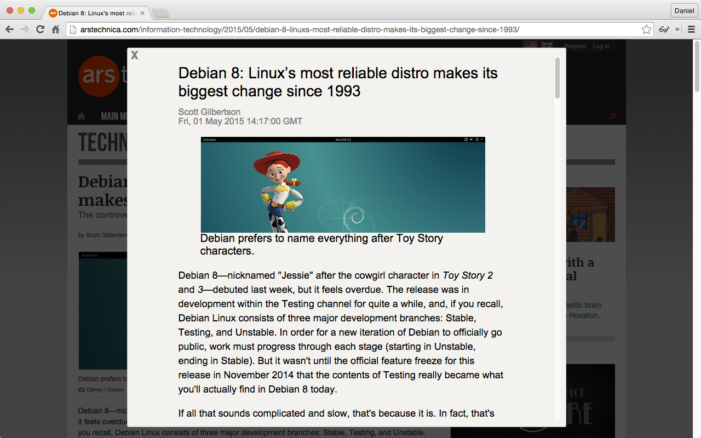

recrun
======

recrun in an acronym that stands for "retain essential content, remove unwanted noise".
It uses the Diffbot Article API to extract relevant content from an article web page.
A Diffbot token is required to use the extension.

A free token can be obtained by signing up at https://www.diffbot.com/plans/free.

recrun is also available from the Chrome Web Store at
https://chrome.google.com/webstore/detail/recrun/ocikmakgbemmhogikcbcbkebeephjcno.

To use recrun, install the extension, sign up for a Diffbot API token, navigate to an
article web page, and click the eyeglasses icon in the Chrome toolbar.

Screenshot
----------

The following image shows the recrun overlay on an article page, after clicking
the *recrun* icon.

